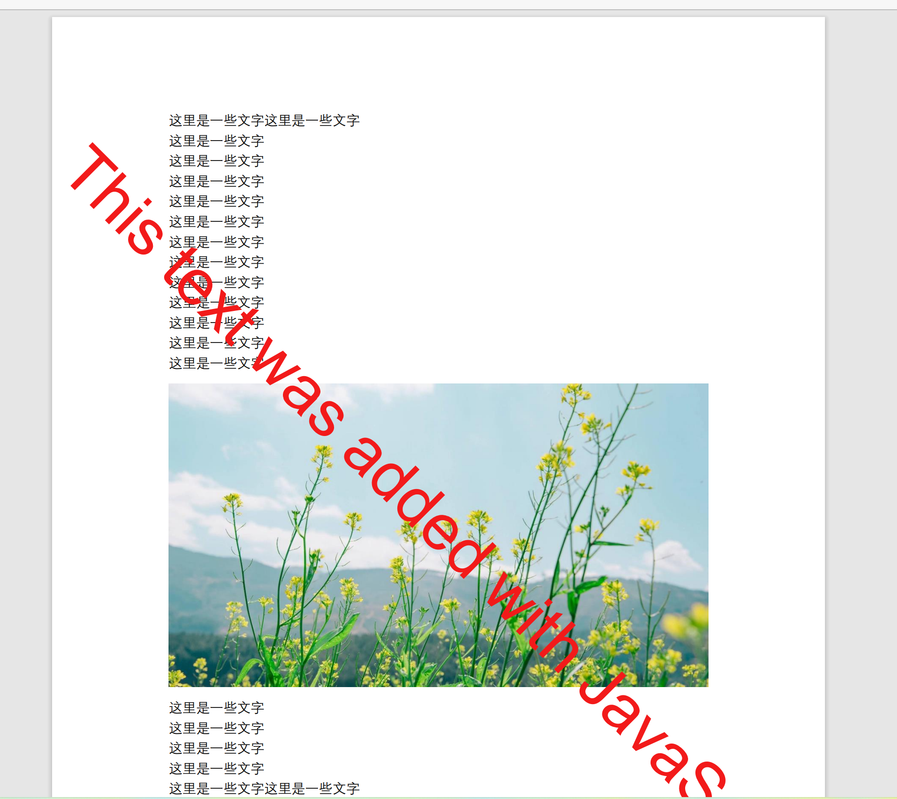

[toc]
# editpdfdemo

> editpdfdemo是vue使用pdf-lib库加载原有pdf文件添加内容。

原文件：


处理后文件：



## Build Setup

``` bash
# install dependencies
npm install

# serve with hot reload at localhost:8080
npm run dev

# build for production with minification
npm run build

# build for production and view the bundle analyzer report
npm run build --report
```

For a detailed explanation on how things work, check out the [guide](http://vuejs-templates.github.io/webpack/) and [docs for vue-loader](http://vuejs.github.io/vue-loader).

> 技术调研
# 调研查阅文档
## 1. jspdf
1. git库：https://github.com/parallax/jsPDF
2. api文档：http://raw.githack.com/MrRio/jsPDF/master/docs/index.html
3. 参考文档：[基于PDF和JSPDF实现调整pdf文件大小功能](https://blog.csdn.net/hbkhbk907/article/details/121150485)
             [JSPDF – 基于 HTML5 的强大 PDF 生成工具](https://www.cnblogs.com/new_2050/p/8097867.html)
4. 结论：jspdf能添加文本、图片、以及根据html代码生成pdf,如果是修改原有pdf需要把原来的pdf每页变成图片然后再添加内容，生成新的pdf文件(变成图片可能存在大小尺寸问题)--未核实
## 2. pdftron
1. 官网地址：https://www.pdftron.com/webviewer/
2. 功能：注释和协作、数字签名、校订、页面操作、创建表单、文档生成...
3. 结论：在线的pdf编辑器，免费试用，需要收费。

## 3. pdf-lib
1. git库地址：https://github.com/Hopding/pdf-lib
2. api接口文档：https://pdf-lib.js.org/docs/api/
2. 功能：创建编辑pdf文档（官方文档提及不提供创建数字签名的功能）
